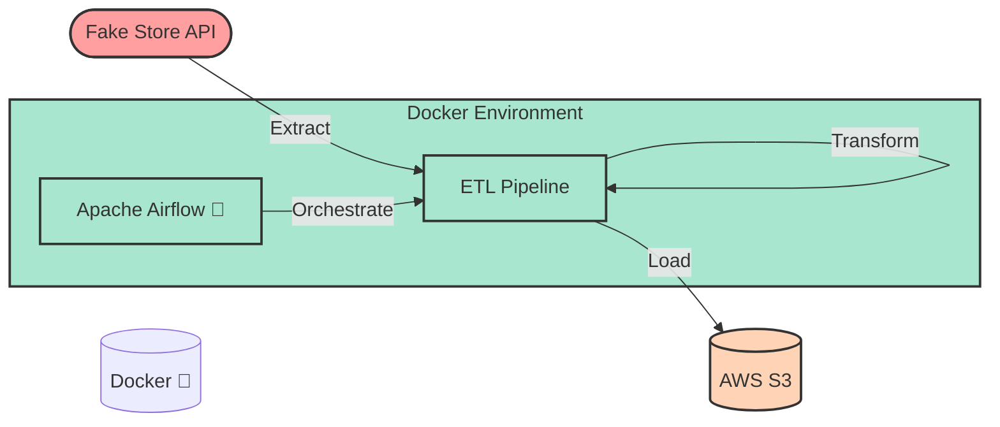

# E-commerce ETL Pipeline with Airflow, AWS & Docker

[](https://www.python.org/)
[](https://airflow.apache.org/)
[](https://www.docker.com/)
[](https://aws.amazon.com/s3/)

## Project Overview

This project implements a **production-ready ETL (Extract, Transform, Load) pipeline** that processes e-commerce data using modern data engineering tools and best practices. The pipeline is fully automated, containerized, and cloud-integrated, making it suitable for real-world deployment scenarios.

### Key Features

- **Automated Data Pipeline**: Scheduled data extraction from the Fake Store API
- **Containerized Workflow**: Complete isolation and reproducibility using Docker
- **Cloud Storage Integration**: Seamless data storage in AWS S3
- **Monitoring & Logging**: Built-in Airflow monitoring and error handling
- **Scalable Architecture**: Designed for handling growing data volumes

## 🏗 Architecture

### System Overview


### Pipeline Stages

1. **Extract** 
   - Fetches product data from the Fake Store API
   - Handles API authentication and rate limiting
   - Stores raw data in JSON format

2. **Transform** 
   - Processes and cleanses raw data
   - Calculates sales metrics and KPIs
   - Categorizes products and aggregates data

3. **Load** 
   - Validates transformed data
   - Uploads to AWS S3 with error handling
   - Maintains data versioning and backup

## Technologies Used

- **Apache Airflow**: Workflow orchestration and scheduling
  - DAG management
  - Task dependencies
  - Error handling and retries

- **Docker & Docker Compose**: Container management
  - Isolated environment
  - Easy deployment
  - Resource management

- **AWS S3**: Cloud storage solution
  - Scalable data storage
  - Data versioning
  - Security compliance

- **Python Ecosystem**:
  - `pandas`: Data manipulation
  - `requests`: API interactions
  - `boto3`: AWS SDK for Python

## Project Structure

```
project_root/
├── config/                     # Configuration management
│   └── settings.py            # Environment and API settings
├── dags/                      # Airflow DAG definitions
│   └── ecommerce_dag.py      # Main ETL pipeline DAG
├── data/                      # Data storage
│   ├── raw/                  # Raw API data
│   └── transformed/          # Processed datasets
├── images/                      # images 
├── etl/                   # ETL processing scripts
│   ├── extract.py           # Data extraction
│   ├── transform.py         # Data transformation
│   └── load_s3.py          # S3 upload logic
├── docker-compose.yaml        # Docker services config
├── Dockerfile                 # Custom Airflow image
├── requirements.txt           # Python dependencies
└── README.md                 # Project documentation
```

## Getting Started

### Prerequisites

- Docker Desktop
- AWS Account with S3 access
- Python 3.10 or higher
- Git

### Installation & Setup

1. **Clone the Repository**
   ```bash
   git clone https://github.com/alexvidi/E-commerce-ETL-Project-Airflow-AWS-Docker.git
   cd E-commerce-ETL-Project-Airflow-AWS-Docker
   ```

2. **Configure AWS Credentials**
   - Create an AWS IAM user with S3 access
   - Set up AWS credentials locally:
     ```bash
     aws configure
     ```

3. **Environment Setup**
   ```bash
   cp .env.example .env
   # Edit .env with your configurations
   ```

4. **Start Docker Services**
   ```bash
   docker-compose up -d
   ```

5. **Access Airflow UI**
   - Open http://localhost:8080
   - Default credentials:
     - Username: airflow
     - Password: ******

### Running the Pipeline

1. Enable the DAG in Airflow UI
2. Monitor the pipeline execution
3. Verify data in AWS S3

##  Monitoring & Maintenance

### Health Checks
- Airflow Web UI: http://localhost:8080
- Docker container status: `docker ps`
- Logs: `docker logs airflow-webserver`

### Common Issues & Solutions

1. **API Connection Issues**
   - Check API key configuration
   - Verify network connectivity

2. **S3 Upload Failures**
   - Validate AWS credentials
   - Check S3 bucket permissions

##  Development Workflow

1. Create feature branch
2. Implement changes
3. Test locally
4. Submit pull request

##  Future Enhancements

- [ ] Real-time data streaming with Apache Kafka
- [ ] Data quality checks with Great Expectations
- [ ] Integration with data warehouses (Snowflake/Redshift)
- [ ] Advanced monitoring with Prometheus/Grafana
- [ ] Implementation of dbt for transformations

##  License

This project is licensed under the MIT License - see the LICENSE file for details.

##  Contributing

1. Fork the repository
2. Create a feature branch
3. Commit changes
4. Push to the branch
5. Open a pull request

##  Contact

Alexandre Vidal - [GitHub](https://github.com/alexvidi)

Project Link: [https://github.com/alexvidi/E-commerce-ETL-Project-Airflow-AWS-Docker](https://github.com/alexvidi/E-commerce-ETL-Project-Airflow-AWS-Docker)